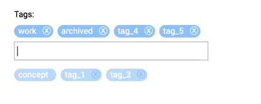

# Simple tags component for Vue.js 3 

<a href="https://www.npmjs.com/package/simple-tags-for-vue">
    
</a>

<a href="https://github.com/beaubus/simple-tags-for-vue/blob/master/LICENSE">
    
</a>
&nbsp;&nbsp;
<a href="https://twitter.com/intent/follow?screen_name=daily_web_dev">
    
</a>

<br>
<br>

A package that allows you to attach or detach tags with ease, following provided suggestions. The tags are styled by default using [Tailwind CSS](https://tailwindcss.com/)



<br>

<a target="_blank" href="https://www.beaubus.com/packages/#simple-tags-for-vue">Demo</a>

## Installation

NPM
```bash
npm i simple-tags-for-vue
```

CDN
```bash
<script src="https://www.unpkg.com/simple-tags-for-vue/dist/simple-tags-for-vue.min.js"></script>
```

## Usage
```js
import simple_tags_for_vue from 'simple-tags-for-vue';

// add to the components section
components: {
    'simple-tags-for-vue': simple_tags_for_vue
}
```

```html
<simple-tags-for-vue v-model="selected_tags"
                     :existing="existing_tags"
></simple-tags-for-vue>
```

### Styling
If you have [tailwindcss](https://tailwindcss.com/) installed, you are good to go. If not, just turn it off `:tailwind="false"`, add `class="your-own-class"` and style it as you need.

### Backend
POST query of the form with simple-tags-for-vue results in an array of 'tags'.

If you use Laravel with [spatie/laravel-tags](https://github.com/spatie/laravel-tags):
```php
<?php

// Get tags
$tags = $model->tags->map(fn($tag) => $tag->name);
$existing_tags = Tag::all()->map(fn($tag) => $tag->name);

// Update tags
$tags = $request->input('tags') ?? [];
$model->syncTags($tags);
```

## Properties
| Name            | Type              | Default     | Description                                        |
| ---             | ---               | ---         | ---                                                |
| modelValue      | Array             | []          | Value for v-model                                  |
| existing        | Array             | []          | List of existing tags (used in suggestions)        |
| unused          | Array             | []          | List of unused tags (can be permanently deleted)   |
| tailwind        | Boolean           | true        | Style with tailwindcss                             |


## Emits
| Name               | Description              |
| ---                | ---                      |
| update:modelValue  | Update event for v-model |
| destroy            | Permanently delete tag   |


## License
The MIT License (MIT). Please see [License File](LICENSE) for more information.
